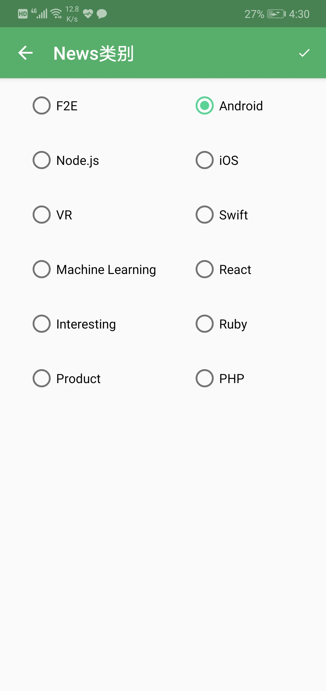

# KDiyCode
使用Kotlin编写的DiyCode客户端，已经完成的功能包括登录、注册、查看Sites、查看News、新建News、查看个人资料、收藏网站、上传图片等

##### 登录
* 根据用户名和密码获取到用户的token，来访问用户信息

##### 注册
* 跳转到官网，进行注册

##### 查看Sites
* 分组显示所有的sites，点击跳转到WebView打开该网址

##### 查看News
* 默认展示Node为Android的News，可以通过点击上面的按钮进行切换，还可以点击类别中用户的头像来查看该用户的资料

##### 新建News
* 通过输入标题、链接、结点(进行选择)来新建一个News(需要审核)

##### 查看个人资料
* 查看当前登录用户的资料，但是接口不支持修改用户的信息

##### 收藏网站
* 使用的是本地数据库存储，在WebView界面可以通过点击菜单来收藏网站，然后在抽屉里面进入到我的收藏页面进行查看、删除(左滑又滑删除，长按复制链接，点击跳转WebView查看)

##### 上传图片
* 作为一个工具，可以把想要分享的图片上传到DiyCode的服务器上，上传完成会显示图片链接，步骤是点击添加图片，跳转到选择图片界面，可以点击菜单筛选文件夹，点击图片进行查看大图，点击右上角的勾确定图片回到第一个界面进行上传

